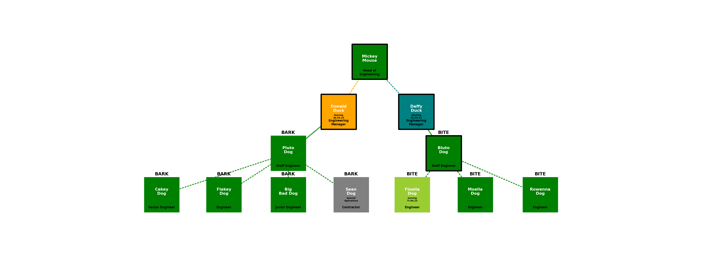

# orgcharts

### Overview
Thsi repo contains a Jupyterlab notebook called [`engineering-org-chart-zero.ipynb`](engineering-org-chart-zero.ipynb) which contains support to allow us to create organograms using the [`organogram.py`](organogram.py) module.  This module leverages the Python `networkx.py` library to draw an organisation diagram directly from a dot file.  

### Generating the dot file
The following code illustrates how to create a dot file from a YAML organisation structure held in [test.yaml](test.yaml).

```
import os
from organogram import OrganisationDiagrammer

org = OrganisationDiagrammer()
g = org.create_graph_from_yaml(org.load_yaml_file('test.yaml'),newline=True)
dotfile = org.create_dotfile_from_graph(g, dot_file='test.dot')
```

The generated dot file can be loaded into a corresponding editor tool such as [Graphity](https://www.graphity.com/).  Graphity allows us to modify the visualisation to a hierarchical display as follows:


Once loaded into Graphity, the organisation diagram elements can then be updated:


### Generating A
Alternatively we can generate an inline image as follows:

```
import os
from organogram import OrganisationDiagrammer

target = 'test.png'
org.create_graphviz_layout_from_graph(g, scale=6, offset=20, node_size=20000, image_file=target)
print(f'Successfully generated organogram into file {target} of size {round(os.path.getsize(target)/1024,1)}kB')
```


