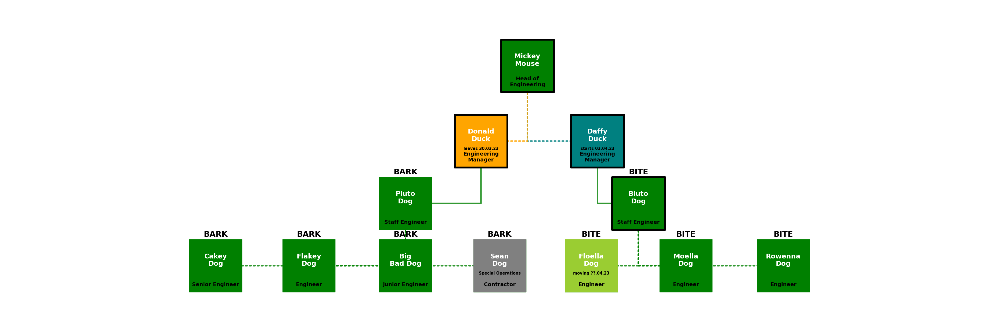

# orgcharts

### Overview
Thsi repo contains a Jupyterlab notebook called [`engineering-org-chart-zero.ipynb`](engineering-org-chart-zero.ipynb) which contains support to allow us to create organograms using the [`organogram.py`](organogram.py) module.  This module leverages the Python `networkx.py` library to generate a network graph from YAML and either use it generate a corresponding local dot file or use it to generate a `graphviz` visual layout diagram of the organisation.

### Installation
Create a `virtualenv` and install dependencies into it as follows:
```
$ pip install -r requirements.txt
```

### YAML format
The YAML specification for an organisation is outlined in this section.  See the accompanying [test.yaml](test.yaml) file for the example organisation drawn in the following sections.  Consider the simplest possible organisation that has a two employees, a CEO called Ty Coon and a CTO called Tech Minion.  They would be represented as two separate nodes and a single edge as follows:
```
nodes:
- id: Ty Coon
  label: CEO
  manager: 'yes'
  status: perm
  team: Team A
  note: tyrant more like
- id: Tech Minion
  label: CTO
  manager: 'no'
  status: perm
  team: Team B
edges:
- relationship: 1
  source: Ty Coon
  target: Tech Minion
```
Here `id` is the name of the person which goes into the node cell and `label` is their job title which goes under the cell.  Their `status` sets the colour of the box - a `perm` employee is green, a `contractor` is grey, `leaving` is orange and `starting` is teal.  If they are a `manager` they get a thick black border round the cell.  The `team` name appears capitalised just above the cell.  You can also add a `note` that goes into the cell.  If `newline` is set True, the graph will put a newline into the first space of the `label` and `note`.  There are three settings that can be adjusted .  First of all `scale` sets the overall size of the text and cells, `offset` adjusts the text spacing and `node_size` sets the size of the cells.  Finally there are two basic styles namely `arc` which draws straight lines between cells and `angle` which draws the traditional right-angled links between the cells.

We can now the following code in a Jupyter notebook on a file called `tycoon.yaml` containing the above YAML:
```
import os
from organogram import OrganisationDiagrammer

target = 'tycoon.png'
org = OrganisationDiagrammer()
g2 = org.create_graph_from_yaml(org.load_yaml_file('tycoon.yaml'),newline=True)
org.create_graphviz_layout_from_graph(g2, scale=3, cstyle='angle', offset=3, node_size=10000, image_file=target)
print(f'Successfully generated organogram into file {target} of size {round(os.path.getsize(target)/1024,1)}kB')
```
This generates the following inline image in the notebook:


### Generating an organisation dot file
The following code illustrates how to create a dot file of the more complex YAML organisation structure held in [test.yaml](test.yaml).

```
import os
from organogram import OrganisationDiagrammer

org = OrganisationDiagrammer()
g = org.create_graph_from_yaml(org.load_yaml_file('test.yaml'),newline=True)
dotfile = org.create_dotfile_from_graph(g, dot_file='test.dot')
```

The generated dot file can be loaded into a corresponding editor tool such as [Graphity](https://www.graphity.com/).  Graphity allows us to modify the visualisation to a hierarchical layout as follows:


Once loaded into Graphity, the organisation diagram elements can then be individually updated and stylee:


### Generating an organisation visual layout using `graphviz`
Alternatively we can generate a visual layout in a .png file as show earlier as follows using [test.yaml](test.yaml):

```
import os
from organogram import OrganisationDiagrammer

target = 'test.png'
org.create_graphviz_layout_from_graph(g, scale=4, cstyle='arc', node_size=12000, image_file=target)
size = os.path.getsize(target)/1024
print(f'Successfully generated organogram into file {target} of size {size}kB')
```

Note the following:
* Managers have a thick black border around their box.
* Employees who are leaving are in orange
* Employees who are yet to join are in teal
* Employees who are moving to another team are in light green
* Contractors are in grey
* All other employees are in dark green
* Direct line management in indicated in a solid line
* Indirect management/supervision is indicated by a dotted line


We can generate a version with right angles that looks more like an org chart as follows:

```
import os
from organogram import OrganisationDiagrammer

target = 'test.png'
org.create_graphviz_layout_from_graph(g, scale=4, cstyle='angle', node_size=12000, image_file=target)
size = os.path.getsize(target)/1024
print(f'Successfully generated organogram into file {target} of size {size}kB')
```



### Tests
Run the test code from the same directory with coverage as follows:
```
$ pytest --exitfirst --failed-first --cov=. --cov-report html -vv
```
