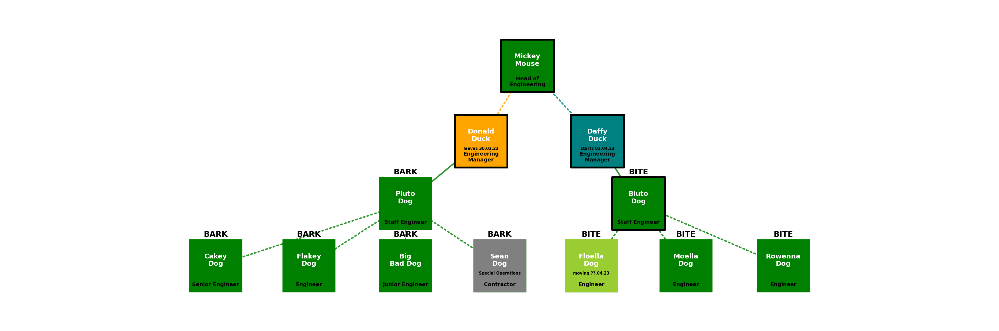

# orgcharts

### Overview
This repo contains a Jupyterlab notebook called [`engineering-org-chart-zero.ipynb`](engineering-org-chart-zero.ipynb) which contains support to allow us to create organograms using the [`organogram.py`](organogram.py) module.  This module leverages the Python `networkx.py` library to generate a network graph from YAML and either use it generate a corresponding local dot file or use it to generate a `graphviz` visual layout diagram of the organisation.

### Installation
1. Create and activate a Python virtual environment:
```bash
python -m venv venv
source venv/bin/activate  # On Mac/Linux
# or
.\venv\Scripts\activate  # On Windows
```

2. Install system dependencies:
```bash
# On Mac with Homebrew
brew install graphviz
```
You will also need to ensure that `dot` is in your environment if not already set:
```bash
export PATH="/opt/homebrew/bin:$PATH"
```

3. Install Python dependencies:
```bash
# Install basic requirements
pip install -r requirements.txt
# Or if you want to install the latest versions of the packages yourself:
pip install pyyaml matplotlib networkx pillow docopt pytest pytest-cov

You will also need to install the `graphviz` Python package:
# Install pygraphviz (for Apple Silicon Macs M1/M2/M3)
CFLAGS="-I/opt/homebrew/opt/graphviz/include" LDFLAGS="-L/opt/homebrew/opt/graphviz/lib" pip install pygraphviz
```

### YAML format
The YAML specification for an organisation is outlined in this section.  See the accompanying [test.yaml](test.yaml) file for the example organisation drawn in the following sections.  Consider the simplest possible organisation that has a two employees, a CEO called Ty Coon and a CTO called Tech Minion.  They would be represented as two separate nodes and a single edge as follows:
```
nodes:
- id: Ty Coon
  label: CEO
  manager: 'yes'
  status: perm
  team: Team A
  note: tyrant more like
- id: Tech Minion
  label: CTO
  manager: 'no'
  status: perm
  team: Team B
edges:
- relationship: 1
  source: Ty Coon
  target: Tech Minion
```
Here `id` is the name of the person which goes into the node cell and `label` is their job title which goes under the cell.  Their `status` sets the colour of the box - a `perm` employee is green, a `contractor` is grey, `leaving` is orange and `starting` is teal.  If they are a `manager` they get a thick black border round the cell.  The `team` name appears capitalised just above the cell.  You can also add a `note` that goes into the cell.  If `newline` is set True, the graph will put a newline into the first space of the `label` and `note`.  There are three settings that can be adjusted .  First of all `scale` sets the overall size of the text and cells, `offset` adjusts the text spacing and `node_size` sets the size of the cells.  Finally there are two basic styles namely `arc` which draws straight lines between cells and `angle` which draws the traditional right-angled links between the cells.

We can now the following code in a Jupyter notebook on a file called `tycoon.yaml` containing the above YAML:
```
import os
from organogram import OrganisationDiagrammer

target = 'tycoon.png'
org = OrganisationDiagrammer()
g2 = org.create_graph_from_yaml(org.load_yaml_file('tycoon.yaml'),newline=True)
org.create_graphviz_layout_from_graph(g2, font_size=16, cstyle='angle', offset=3, node_size=10000, image_file=target)
print(f'Successfully generated organogram into file {target} of size {round(os.path.getsize(target)/1024,1)}kB')
```
This generates the following inline image in the notebook:


### Generating an organisation dot file
The following code illustrates how to create a dot file of the more complex YAML organisation structure held in [test.yaml](test.yaml).

```
import os
from organogram import OrganisationDiagrammer

org = OrganisationDiagrammer()
g = org.create_graph_from_yaml(org.load_yaml_file('test.yaml'),newline=True)
dotfile = org.create_dotfile_from_graph(g, dot_file='test.dot')
```

The generated dot file can be loaded into a corresponding editor tool such as [Graphity](https://www.graphity.com/).  Graphity allows us to modify the visualisation to a hierarchical layout as follows:


Once loaded into Graphity, the organisation diagram elements can then be individually updated and stylee:


### Generating an organisation visual layout using `graphviz`
Alternatively we can generate a visual layout in a .png file as show earlier as follows using [test.yaml](test.yaml):

```
import os
from organogram import OrganisationDiagrammer

target = 'test.png'
g = org.create_graphviz_layout_from_graph(g, font_size=14, cstyle='arc', margin=0.3, offset=7, node_size=20000, scale=3, resetScale=False, image_file=target)
print(f'Successfully generated organogram into file {target} of size {round(os.path.getsize(target)/1024,1)}kB')
```
This corresponds to the following command line:
```
python organogram.py -s test.yaml --margin 0.3 -f arc -n 20000 --offset 7 -x 14
```

Note the following:
* Managers have a thick black border around their box.
* Employees who are leaving are in orange
* Employees who are yet to be hired are in red
* Employees who are hired but yet to join are in teal
* Employees who are moving to another team are in light green
* Contractors are in grey
* All other employees are in dark green
* Direct line management in indicated in a solid line
* Indirect management/supervision is indicated by a dotted line



We can generate a version with right angles that looks more like an org chart as follows:

```
import os
from organogram import OrganisationDiagrammer

target = 'test2.png'
g = org.create_graphviz_layout_from_graph(g, font_size=14, cstyle='angle', margin=0.3, offset=7, node_size=20000, scale=3, resetScale=False, image_file=target)
print(f'Successfully generated organogram into file {target} of size {round(os.path.getsize(target)/1024,1)}kB')
```
This corresponds to the following command line:
```
python organogram.py -s test.yaml --margin 0.3 -f angle -n 20000 --offset 7 -x 14
```


### CLI
There is a command line interface built into the module.  Here's the built in help:
```
$ python organogram.py -h
    organogram.py
    ----------------
    Usage:
    organogram.py -s <source> [-m <margin>] [-n <nodesize>] [-f <style>] [-o <offset>] [-x <fontsize>] [-v]
    organogram.py -h | --help
    organogram.py -V | --version
    Options:
    -h, --help                              Show this screen.
    -v, --verbose                           Verbose mode.
    -V, --version                           Show version.
    -s <source>, --source <source>          Source YAML.
    -n <nodesize>, --nodesize <nodesize>    Node size.  Default is 7000.
    -m <margin>, --margin <margin>          Margin.  Default 0.1.
    -f <style>, --style <style>             Edge style. Default is arc3.
    -o <offset>, --offset <offset>          Offset.  Default is 0.
    -x <fontsize>, --fontsize <fontsize>    Font size of node text.  Default is 12.
    Examples
    1. Generate verbose graphviz visualisation of test.yaml:
    organogram.py -s test.yaml --margin 0.2 -f angle3 -n 7500 --offset 8 -x 16 -v
    2. Generate graphviz visualisation of tycoon.yaml:
    organogram.py -s tycoon.yaml --margin 0.2 -f angle -n 15000 --offset 3 -x 18
    3. Generate graphviz visualisation of homeowner.yaml:
    organogram.py -s homeowner.yaml --margin 0.01 -f arc -n 7500 -o 5 -x 14
```
And here's an example of how to use it to build the above organogram from the included `test.yaml` with verbose logging enabled:
```
$ python organogram.py -s test.yaml --margin 0.3 -f angle -n 20000 --offset 7 -x 14 -v
```

### Tests
Run the test code from the same directory with coverage as follows:
```
$ pytest --exitfirst --failed-first --cov=. --cov-report html -vv
==================================================================== test session starts =====================================================================
platform darwin -- Python 3.11.11, pytest-8.3.4, pluggy-1.5.0 -- /Users/malm/.virtualenvs/orgcharts/bin/python
cachedir: .pytest_cache
rootdir: /Users/mal.minhas/Desktop/CODE/personal/orgcharts
plugins: cov-6.0.0, anyio-4.8.0
collected 15 items                                                                                                                                           
run-last-failure: no previously failed tests, not deselecting items.

tests/test_organogram.py::test_load_yaml_file PASSED                                                                                                   [  6%]
tests/test_organogram.py::test_create_graph_from_yaml PASSED                                                                                           [ 13%]
tests/test_organogram.py::test_create_valid_teams_and_status PASSED                                                                                    [ 20%]
tests/test_organogram.py::test_create_graph_from_yaml_validate PASSED                                                                                  [ 26%]
tests/test_organogram.py::test_create_dotfile_from_graph PASSED                                                                                        [ 33%]
tests/test_organogram.py::test_create_graphviz_layout_from_graph PASSED                                                                                [ 40%]
tests/test_organogram.py::test_load_yaml_file_zero PASSED                                                                                              [ 46%]
tests/test_organogram.py::test_load_yaml_file_none PASSED                                                                                              [ 53%]
tests/test_organogram.py::test_create_graph_from_yaml_none PASSED                                                                                      [ 60%]
tests/test_organogram.py::test_load_yaml_file_mini PASSED                                                                                              [ 66%]
tests/test_organogram.py::test_create_graph_from_yaml_mini PASSED                                                                                      [ 73%]
tests/test_organogram.py::test_create_graph_from_yaml_mini_validate PASSED                                                                             [ 80%]
tests/test_organogram.py::test_main_no_args PASSED                                                                                                     [ 86%]
tests/test_organogram.py::test_main_verbose PASSED                                                                                                     [ 93%]
tests/test_organogram.py::test_main_some_args PASSED                                                                                                   [100%]

--------- coverage: platform darwin, python 3.11.11-final-0 ----------
Coverage HTML written to dir htmlcov

===================================================================== 15 passed in 1.59s =====================================================================
```
Test coverage is currently at 92%.


### Documentation
Run the Sphinx documentation as follows:
```
$ cd docs
$ pip install sphinx sphinx-rtd-theme
$ make html
$ open build/html/index.html
```
Here's an example of what it looks like:


